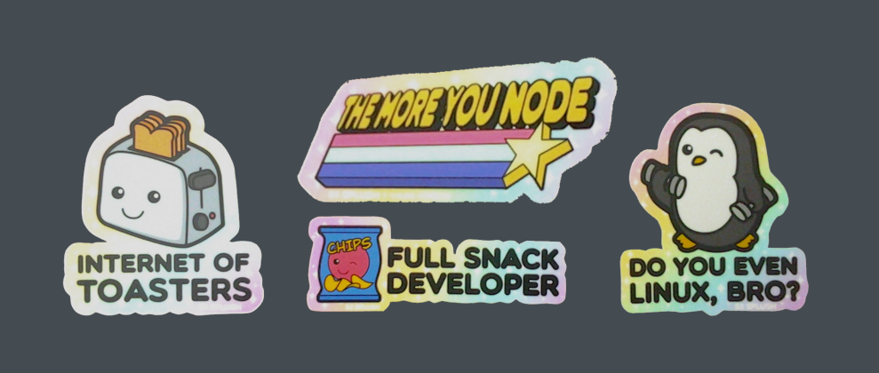
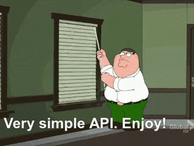

<!-- <h1>😄 HELLO WORLD 😄</h1> -->

<!--  -->

<!--

-->

<!--
[(https://github.com/dacoffey)
-->

---
---

## :zap: IT Solutions Provider

- ### :octocat: [GitHub](https://github.com/cogsmith)
- ### 📝 [Gists](https://gist.github.com/dacoffey)
- ### 🐳 [Docker](https://hub.docker.com/u/cogsmith)
- ### :gear: [COGSMITH](http://cogsmith.com)
- ### 💖 [Sponsor Me](https://github.com/sponsors/dacoffey)
- ### 💼 [LinkedIn](https://linkedin.com/in/dacoffey)
- ### :toolbox: [StackOverflow](https://stackoverflow.com/users/1477533/dac)
- ### :mage: [David-Adam-Coffey](http://david-adam-coffey.com)

---

---

## :rocket: Full Stack Expertise

- <b>DevOps</b>: Linux, VirtualBox, Docker, GitHub Actions, AWS, MS Teams, VS Code
- <b>Backend</b>: SQL, Mongo, Redis, C#, .NET, NodeJS, Fastify, Express
- <b>Frontend</b>: JS, JQuery, TypeScript, React, Gatsby, Bulma, Electron, Material UI
- <b>Networking</b>: IpTables, NTop, DnsMasq, PXE, SSH, RDP, NAS, Samba, LDAP
- <b>Embedded</b>: IoT, Pi, Arduino, ESP32, ESPHome, Home Assistant
- <b>Crypto</b>: ACME, Blockchain, Bitcoin, Ethereum, Solidity, Smart Contracts

---
---

## 💻 Favorite Quotes

<code>
  The three chief virtues of a programmer are: <u>Laziness</u>, <u>Impatience</u>, and <u>Hubris</u>
  -- <b>Larry Wall</b>
</code>

 

<code>
  The most damaging phrase in language is: <i>it's always been done this way</i>
  -- <b>Grace Hopper</b>
</code>

 

<code>
  In programming, as in everything else, to be in error is to be reborn
  -- <b>Alan Perlis</b>
</code>

 

<code>
  Everything should be made as simple as possible, but no simpler
  -- <b>Albert Einstein</b>
</code>

 

<code>
  Blame nobody, expect nothing, do something!
  -- <b>Bill Parcells</b>
</code>

 

<code>
  Talk is cheap, show me the code
  -- <b>Linus Torvalds</b>
</code>

 

<code>
  All programmers are optimists
  -- <b>Fred Brooks</b>
</code>

 

<code>
  Real artists ship
  -- <b>Steve Jobs</b>
</code>

---
---

## ⭐ XT: Application Framework

---

## ⭐ HIVE: Simple Filesystem-Based Docker Orchestration

---

## ⭐ WEB: HTTP Servers Designed For HIVE Hosting Or Standalone Use

---

## ⭐ DEVKING: GitHub Actions & Development Helpers

<!--

-->

---

## ⭐ HX: Home Assistant Addons

---

## ⭐ SKEL: Project Templates

---

## ⭐ TOOLS: Custom Utilities

---

## ⭐ README: You Are Here!

---
---

<!--
**dacoffey/dacoffey** is a ✨ _special_ ✨ repository because its `README.md` (this file) appears on your GitHub profile.

Here are some ideas to get you started:

- 🔭 I’m currently working on ...
- 🌱 I’m currently learning ...
- 👯 I’m looking to collaborate on ...
- 🤔 I’m looking for help with ...
- 💬 Ask me about ...
- 📫 How to reach me: ...
- 😄 Pronouns: ...
- ⚡ Fun fact: ...
-->
